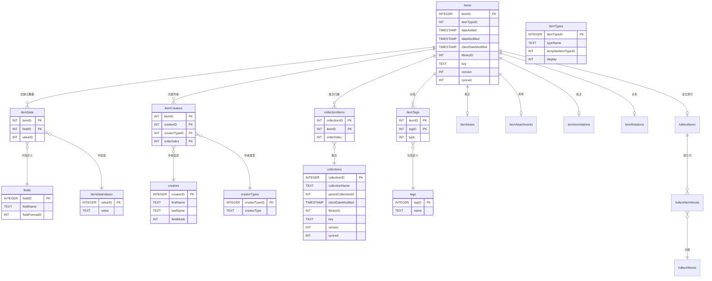

# Zotero 数据库结构报告

## 数据库基本信息

| 属性 | 值 |
| ---- | --- |
| 数据库路径 | `D:\Zotero\Date-Directary\zotero.sqlite` |
| 文件大小 | 5210112 bytes (4.97 MB) |
| 总表数 | 61 |

## 所有表清单

1. baseFieldMappings
2. baseFieldMappingsCombined
3. charsets
4. collectionItems
5. collectionRelations
6. collections
7. creatorTypes
8. creators
9. customBaseFieldMappings
10. customFields
11. customItemTypeFields
12. customItemTypes
13. dbDebug1
14. deletedCollections
15. deletedItems
16. deletedSearches
17. feedItems
18. feeds
19. fieldFormats
20. fields
21. fieldsCombined
22. fileTypeMimeTypes
23. fileTypes
24. fulltextItemWords
25. fulltextItems
26. fulltextWords
27. groupItems
28. groups
29. itemAnnotations
30. itemAttachments
31. itemCreators
32. itemData
33. itemDataValues
34. itemNotes
35. itemRelations
36. itemTags
37. itemTypeCreatorTypes
38. itemTypeFields
39. itemTypeFieldsCombined
40. itemTypes
41. itemTypesCombined
42. items
43. libraries
44. proxies
45. proxyHosts
46. publicationsItems
47. relationPredicates
48. retractedItems
49. savedSearchConditions
50. savedSearches
51. settings
52. storageDeleteLog
53. syncCache
54. syncDeleteLog
55. syncObjectTypes
56. syncQueue
57. syncedSettings
58. tags
59. translatorCache
60. users
61. version

## 核心表结构

### items 表（文献表）

| 序号 | 字段名 | 类型 | 非空 | 默认值 | 主键 |
| ---- | ------ | ---- | ---- | ------ | ---- |
| 0 | itemID | INTEGER | 否 | - | 是 |
| 1 | itemTypeID | INT | 是 | - | 否 |
| 2 | dateAdded | TIMESTAMP | 是 | CURRENT_TIMESTAMP | 否 |
| 3 | dateModified | TIMESTAMP | 是 | CURRENT_TIMESTAMP | 否 |
| 4 | clientDateModified | TIMESTAMP | 是 | CURRENT_TIMESTAMP | 否 |
| 5 | libraryID | INT | 是 | - | 否 |
| 6 | key | TEXT | 是 | - | 否 |
| 7 | version | INT | 是 | 0 | 否 |
| 8 | synced | INT | 是 | 0 | 否 |

**说明**：items 表是 Zotero 的核心文献表，存储所有文献元数据的主信息。共 2 行数据。

### itemData 表（文献数据表）

| 序号 | 字段名 | 类型 | 非空 | 默认值 | 主键 |
| ---- | ------ | ---- | ---- | ------ | ---- |
| 0 | itemID | INT | 否 | - | 是 |
| 1 | fieldID | INT | 否 | - | 是 |
| 2 | valueID | (空) | 否 | - | 否 |

**说明**：itemData 存储文献的动态字段数据，通过 fieldID 关联 fields 表获取字段名，字段值存储在 itemDataValues 表中（通过 valueID 关联）。共 14 行数据。

### fields 表（字段定义表）

| 序号 | 字段名 | 类型 | 非空 | 默认值 | 主键 |
| ---- | ------ | ---- | ---- | ------ | ---- |
| 0 | fieldID | INTEGER | 否 | - | 是 |
| 1 | fieldName | TEXT | 否 | - | 否 |
| 2 | fieldFormatID | INT | 否 | - | 否 |

**说明**：fields 表存储字段定义，共 123 个字段，fieldFormatID 用于区分字段格式类型。

### itemDataValues 表（字段值表）

| 序号 | 字段名 | 类型 | 非空 | 默认值 | 主键 |
| ---- | ------ | ---- | ---- | ------ | ---- |
| 0 | valueID | INTEGER | 否 | - | 是 |
| 1 | value | (空) | 否 | - | 否 |

**说明**：itemDataValues 表存储实际字段值，itemData 通过 valueID 关联获取字段值。共 14 行数据。

### itemCreators 表（文献-作者关联表）

| 序号 | 字段名 | 类型 | 非空 | 默认值 | 主键 |
| ---- | ------ | ---- | ---- | ------ | ---- |
| 0 | itemID | INT | 是 | - | 是 |
| 1 | creatorID | INT | 是 | - | 是 |
| 2 | creatorTypeID | INT | 是 | 1 | 是 |
| 3 | orderIndex | INT | 是 | 0 | 是 |

**说明**：itemCreators 是连接 items 表和 creators 表的关联表，使用 (itemID, creatorID, creatorTypeID, orderIndex) 复合主键。共 6 行数据。

### creators 表（作者表）

| 序号 | 字段名 | 类型 | 非空 | 默认值 | 主键 |
| ---- | ------ | ---- | ------ | ---- | ---- |
| 0 | creatorID | INTEGER | 否 | - | 是 |
| 1 | firstName | TEXT | 否 | - | 否 |
| 2 | lastName | TEXT | 否 | - | 否 |
| 3 | fieldMode | INT | 否 | - | 否 |

**说明**：creators 表存储作者信息。firstName 和 lastName 分别存储名字和姓氏，fieldMode 字段用于区分单字段模式和双字段模式。共 6 行数据。

### creatorTypes 表（作者类型表）

| 序号 | 字段名 | 类型 | 非空 | 默认值 | 主键 |
| ---- | ------ | ---- | ---- | ------ | ---- |
| 0 | creatorTypeID | INTEGER | 否 | - | 是 |
| 1 | creatorType | TEXT | 否 | - | 否 |

**说明**：creatorTypes 表存储作者类型定义（如：普通作者、编辑、译者等）。共 37 行数据。

### collections 表（集合表）

| 序号 | 字段名 | 类型 | 非空 | 默认值 | 主键 |
| ---- | ------ | ---- | ---- | ------ | ---- |
| 0 | collectionID | INTEGER | 否 | - | 是 |
| 1 | collectionName | TEXT | 是 | - | 否 |
| 2 | parentCollectionID | INT | 否 | NULL | 否 |
| 3 | clientDateModified | TIMESTAMP | 是 | CURRENT_TIMESTAMP | 否 |
| 4 | libraryID | INT | 是 | - | 否 |
| 5 | key | TEXT | 是 | - | 否 |
| 6 | version | INT | 是 | 0 | 否 |
| 7 | synced | INT | 是 | 0 | 否 |

**说明**：collections 表存储文献集合（文件夹）信息，支持层级结构（通过 parentCollectionID 自关联）。共 0 行数据。

### collectionItems 表（集合-文献关联表）

| 序号 | 字段名 | 类型 | 非空 | 默认值 | 主键 |
| ---- | ------ | ---- | ---- | ------ | ---- |
| 0 | collectionID | INT | 是 | - | 是 |
| 1 | itemID | INT | 是 | - | 是 |
| 2 | orderIndex | INT | 是 | 0 | 否 |

**说明**：collectionItems 是连接 collections 表和 items 表的关联表。共 0 行数据。

### tags 表（标签表）

| 序号 | 字段名 | 类型 | 非空 | 默认值 | 主键 |
| ---- | ------ | ---- | ---- | ------ | ---- |
| 0 | tagID | INTEGER | 否 | - | 是 |
| 1 | name | TEXT | 是 | - | 否 |

**说明**：tags 表存储标签信息。共 0 行数据。

### itemTags 表（文献-标签关联表）

| 序号 | 字段名 | 类型 | 非空 | 默认值 | 主键 |
| ---- | ------ | ---- | ---- | ------ | ---- |
| 0 | itemID | INT | 是 | - | 是 |
| 1 | tagID | INT | 是 | - | 是 |
| 2 | type | INT | 是 | - | 否 |

**说明**：itemTags 是连接 items 表和 tags 表的关联表。共 0 行数据。

### itemTypes 表（文献类型表）

| 序号 | 字段名 | 类型 | 非空 | 默认值 | 主键 |
| ---- | ------ | ---- | ---- | ------ | ---- |
| 0 | itemTypeID | INTEGER | 否 | - | 是 |
| 1 | typeName | TEXT | 否 | - | 否 |
| 2 | templateItemTypeID | INT | 否 | - | 否 |
| 3 | display | INT | 否 | 1 | 否 |

**说明**：itemTypes 表存储文献类型定义（如：期刊文章、书籍、网页等）。共 40 行数据。

### itemTypeFields 表（文献类型字段表）

| 序号 | 字段名 | 类型 | 非空 | 默认值 | 主键 |
| ---- | ------ | ---- | ---- | ------ | ---- |
| 0 | itemTypeID | INT | 否 | - | 是 |
| 1 | fieldID | INT | 否 | - | 否 |
| 2 | hide | INT | 否 | - | 否 |
| 3 | orderIndex | INT | 否 | - | 是 |

**说明**：itemTypeFields 定义每种文献类型对应的字段。共 770 行数据。

### itemNotes 表（文献笔记表）

| 序号 | 字段名 | 类型 | 非空 | 默认值 | 主键 |
| ---- | ------ | ---- | ---- | ------ | ---- |
| 0 | itemID | INTEGER | 否 | - | 是 |
| 1 | parentItemID | INT | 否 | - | 否 |
| 2 | note | TEXT | 否 | - | 否 |
| 3 | title | TEXT | 否 | - | 否 |

**说明**：itemNotes 表存储文献笔记。共 0 行数据。

### itemAttachments 表（文献附件表）

| 序号 | 字段名 | 类型 | 非空 | 默认值 | 主键 |
| ---- | ------ | ---- | ---- | ------ | ---- |
| 0 | itemID | INTEGER | 否 | - | 是 |
| 1 | parentItemID | INT | 否 | - | 否 |
| 2 | linkMode | INT | 否 | - | 否 |
| 3 | contentType | TEXT | 否 | - | 否 |
| 4 | charsetID | INT | 否 | - | 否 |
| 5 | path | TEXT | 否 | - | 否 |
| 6 | syncState | INT | 否 | 0 | 否 |
| 7 | storageModTime | INT | 否 | - | 否 |
| 8 | storageHash | TEXT | 否 | - | 否 |
| 9 | lastProcessedModificationTime | INT | 否 | - | 否 |
| 10 | lastRead | INT | 否 | - | 否 |

**说明**：itemAttachments 表存储文献附件（如 PDF）信息。共 1 行数据。

### deletedItems 表（已删除文献表）

| 序号 | 字段名 | 类型 | 非空 | 默认值 | 主键 |
| ---- | ------ | ---- | ---- | ------ | ---- |
| 0 | itemID | INTEGER | 否 | - | 是 |
| 1 | dateDeleted | (空) | 是 | CURRENT_TIMESTAMP | 否 |

**说明**：deletedItems 表存储已删除文献的记录（用于同步）。共 0 行数据。

### fulltextItems 表（全文索引表）

| 序号 | 字段名 | 类型 | 非空 | 默认值 | 主键 |
| ---- | ------ | ---- | ---- | ------ | ---- |
| 0 | itemID | INTEGER | 否 | - | 是 |
| 1 | indexedPages | INT | 否 | - | 否 |
| 2 | totalPages | INT | 否 | - | 否 |
| 3 | indexedChars | INT | 否 | - | 否 |
| 4 | totalChars | INT | 否 | - | 否 |
| 5 | version | INT | 是 | 0 | 否 |
| 6 | synced | INT | 是 | 0 | 否 |

**说明**：fulltextItems 表存储 PDF 全文索引信息。共 1 行数据。

### fulltextWords 表（全文词表）

| 序号 | 字段名 | 类型 | 非空 | 默认值 | 主键 |
| ---- | ------ | ---- | ---- | ------ | ---- |
| 0 | wordID | INTEGER | 否 | - | 是 |
| 1 | word | TEXT | 否 | - | 否 |

**说明**：fulltextWords 表存储全文索引的单词。共 1728 行数据。

### fulltextItemWords 表（全文-文献关联表）

| 序号 | 字段名 | 类型 | 非空 | 默认值 | 主键 |
| ---- | ------ | ---- | ---- | ------ | ---- |
| 0 | wordID | INT | 否 | - | 是 |
| 1 | itemID | INT | 否 | - | 是 |

**说明**：fulltextItemWords 是连接 fulltextWords 表和 items 表的关联表。共 1728 行数据。

### itemAnnotations 表（文献批注表）

| 序号 | 字段名 | 类型 | 非空 | 默认值 | 主键 |
| ---- | ------ | ---- | ---- | ------ | ---- |
| 0 | itemID | INTEGER | 否 | - | 是 |
| 1 | parentItemID | INT | 是 | - | 否 |
| 2 | type | INTEGER | 是 | - | 否 |
| 3 | authorName | TEXT | 否 | - | 否 |
| 4 | text | TEXT | 否 | - | 否 |
| 5 | comment | TEXT | 否 | - | 否 |
| 6 | color | TEXT | 否 | - | 否 |
| 7 | pageLabel | TEXT | 否 | - | 否 |
| 8 | sortIndex | TEXT | 是 | - | 否 |
| 9 | position | TEXT | 是 | - | 否 |
| 10 | isExternal | INT | 是 | - | 否 |

**说明**：itemAnnotations 表存储 PDF 批注信息。共 0 行数据。

### itemRelations 表（文献关系表）

| 序号 | 字段名 | 类型 | 非空 | 默认值 | 主键 |
| ---- | ------ | ---- | ---- | ------ | ---- |
| 0 | itemID | INT | 是 | - | 是 |
| 1 | predicateID | INT | 是 | - | 是 |
| 2 | object | TEXT | 是 | - | 是 |

**说明**：itemRelations 表存储文献之间的关系。共 0 行数据。

### relationPredicates 表（关系谓词表）

| 序号 | 字段名 | 类型 | 非空 | 默认值 | 主键 |
| ---- | ------ | ---- | ---- | ------ | ---- |
| 0 | predicateID | INTEGER | 否 | - | 是 |
| 1 | predicate | TEXT | 否 | - | 否 |

**说明**：relationPredicates 表存储关系谓词定义。共 0 行数据。

### settings 表（设置表）

| 序号 | 字段名 | 类型 | 非空 | 默认值 | 主键 |
| ---- | ------ | ---- | ---- | ------ | ---- |
| 0 | setting | TEXT | 否 | - | 是 |
| 1 | key | TEXT | 否 | - | 是 |
| 2 | value | (空) | 否 | - | 否 |

**说明**：settings 表存储应用设置。共 4 行数据。

### version 表（版本表）

| 序号 | 字段名 | 类型 | 非空 | 默认值 | 主键 |
| ---- | ------ | ---- | ---- | ------ | ---- |
| 0 | schema | TEXT | 否 | - | 是 |
| 1 | version | INT | 是 | - | 否 |

**说明**：version 表存储数据库 schema 版本信息。共 10 行数据。

### syncObjectTypes 表（同步对象类型表）

| 序号 | 字段名 | 类型 | 非空 | 默认值 | 主键 |
| ---- | ------ | ---- | ---- | ------ | ---- |
| 0 | syncObjectTypeID | INTEGER | 否 | - | 是 |
| 1 | name | TEXT | 否 | - | 否 |

**说明**：syncObjectTypes 表存储同步对象类型定义。共 7 行数据。

### syncQueue 表（同步队列表）

| 序号 | 字段名 | 类型 | 非空 | 默认值 | 主键 |
| ---- | ------ | ---- | ---- | ------ | ---- |
| 0 | libraryID | INT | 是 | - | 是 |
| 1 | key | TEXT | 是 | - | 是 |
| 2 | syncObjectTypeID | INT | 是 | - | 是 |
| 3 | lastCheck | TIMESTAMP | 否 | - | 否 |
| 4 | tries | INT | 否 | - | 否 |

**说明**：syncQueue 表存储同步队列信息。共 0 行数据。

### syncCache 表（同步缓存表）

| 序号 | 字段名 | 类型 | 非空 | 默认值 | 主键 |
| ---- | ------ | ---- | ---- | ------ | ---- |
| 0 | libraryID | INT | 是 | - | 是 |
| 1 | key | TEXT | 是 | - | 是 |
| 2 | syncObjectTypeID | INT | 是 | - | 是 |
| 3 | version | INT | 是 | - | 是 |
| 4 | data | TEXT | 否 | - | 否 |

**说明**：syncCache 表存储同步缓存。共 0 行数据。

### syncDeleteLog 表（同步删除日志表）

| 序号 | 字段名 | 类型 | 非空 | 默认值 | 主键 |
| ---- | ------ | ---- | ---- | ------ | ---- |
| 0 | syncObjectTypeID | INT | 是 | - | 否 |
| 1 | libraryID | INT | 是 | - | 否 |
| 2 | key | TEXT | 是 | - | 否 |
| 3 | dateDeleted | TEXT | 是 | CURRENT_TIMESTAMP | 否 |

**说明**：syncDeleteLog 表存储同步删除日志。共 0 行数据。

### syncedSettings 表（已同步设置表）

| 序号 | 字段名 | 类型 | 非空 | 默认值 | 主键 |
| ---- | ------ | ---- | ---- | ------ | ---- |
| 0 | setting | TEXT | 是 | - | 是 |
| 1 | libraryID | INT | 是 | - | 是 |
| 2 | value | (空) | 是 | - | 否 |
| 3 | version | INT | 是 | 0 | 否 |
| 4 | synced | INT | 是 | 0 | 否 |

**说明**：syncedSettings 表存储已同步的设置。共 0 行数据。

### itemTypeCreatorTypes 表（文献类型-作者类型关联表）

| 序号 | 字段名 | 类型 | 非空 | 默认值 | 主键 |
| ---- | ------ | ---- | ---- | ------ | ---- |
| 0 | itemTypeID | INT | 否 | - | 是 |
| 1 | creatorTypeID | INT | 否 | - | 是 |
| 2 | primaryField | INT | 否 | - | 否 |

**说明**：itemTypeCreatorTypes 定义每种文献类型支持的作者类型。共 170 行数据。

### baseFieldMappings 表（基础字段映射表）

| 序号 | 字段名 | 类型 | 非空 | 默认值 | 主键 |
| ---- | ------ | ---- | ---- | ------ | ---- |
| 0 | itemTypeID | INT | 否 | - | 是 |
| 1 | baseFieldID | INT | 否 | - | 是 |
| 2 | fieldID | INT | 否 | - | 是 |

**说明**：baseFieldMappings 表定义文献类型与基础字段的映射。共 72 行数据。

### libraries 表（文献库表）

| 序号 | 字段名 | 类型 | 非空 | 默认值 | 主键 |
| ---- | ------ | ---- | ---- | ------ | ---- |
| 0 | libraryID | INTEGER | 否 | - | 是 |
| 1 | type | TEXT | 是 | - | 否 |
| 2 | editable | INT | 是 | - | 否 |
| 3 | filesEditable | INT | 是 | - | 否 |
| 4 | version | INT | 是 | 0 | 否 |
| 5 | storageVersion | INT | 是 | 0 | 否 |
| 6 | lastSync | INT | 是 | 0 | 否 |
| 7 | archived | INT | 是 | 0 | 否 |
| 8 | isAdmin | INT | 是 | 0 | 否 |

**说明**：libraries 表存储文献库信息。共 1 行数据。

### savedSearches 表（保存的搜索表）

| 序号 | 字段名 | 类型 | 非空 | 默认值 | 主键 |
| ---- | ------ | ---- | ---- | ------ | ---- |
| 0 | savedSearchID | INTEGER | 否 | - | 是 |
| 1 | savedSearchName | TEXT | 是 | - | 否 |
| 2 | clientDateModified | TIMESTAMP | 是 | CURRENT_TIMESTAMP | 否 |
| 3 | libraryID | INT | 是 | - | 否 |
| 4 | key | TEXT | 是 | - | 否 |
| 5 | version | INT | 是 | 0 | 否 |
| 6 | synced | INT | 是 | 0 | 否 |

**说明**：savedSearches 表存储保存的搜索。共 0 行数据。

### savedSearchConditions 表（搜索条件表）

| 序号 | 字段名 | 类型 | 非空 | 默认值 | 主键 |
| ---- | ------ | ---- | ---- | ------ | ---- |
| 0 | savedSearchID | INT | 是 | - | 是 |
| 1 | searchConditionID | INT | 是 | - | 是 |
| 2 | condition | TEXT | 是 | - | 否 |
| 3 | operator | TEXT | 否 | - | 否 |
| 4 | value | TEXT | 否 | - | 否 |
| 5 | required | NONE | 否 | - | 否 |

**说明**：savedSearchConditions 表存储搜索条件。共 0 行数据。

### translatorCache 表（翻译器缓存表）

| 序号 | 字段名 | 类型 | 非空 | 默认值 | 主键 |
| ---- | ------ | ---- | ---- | ------ | ---- |
| 0 | fileName | TEXT | 否 | - | 是 |
| 1 | metadataJSON | TEXT | 否 | - | 否 |
| 2 | lastModifiedTime | INT | 否 | - | 否 |

**说明**：translatorCache 表存储翻译器缓存。共 748 行数据。

### collectionRelations 表（集合关系表）

| 序号 | 字段名 | 类型 | 非空 | 默认值 | 主键 |
| ---- | ------ | ---- | ---- | ------ | ---- |
| 0 | collectionID | INT | 是 | - | 是 |
| 1 | predicateID | INT | 是 | - | 是 |
| 2 | object | TEXT | 是 | - | 是 |

**说明**：collectionRelations 表存储集合之间的关系。共 0 行数据。

### retractedItems 表（撤稿表）

| 序号 | 字段名 | 类型 | 非空 | 默认值 | 主键 |
| ---- | ------ | ---- | ---- | ------ | ---- |
| 0 | itemID | INTEGER | 否 | - | 是 |
| 1 | data | TEXT | 否 | - | 否 |
| 2 | flag | INT | 否 | 0 | 否 |

**说明**：retractedItems 表存储撤稿文献信息。共 0 行数据。

### feeds 表（订阅源表）

| 序号 | 字段名 | 类型 | 非空 | 默认值 | 主键 |
| ---- | ------ | ---- | ---- | ------ | ---- |
| 0 | libraryID | INTEGER | 否 | - | 是 |
| 1 | name | TEXT | 是 | - | 否 |
| 2 | url | TEXT | 是 | - | 否 |
| 3 | lastUpdate | TIMESTAMP | 否 | - | 否 |
| 4 | lastCheck | TIMESTAMP | 否 | - | 否 |
| 5 | lastCheckError | TEXT | 否 | - | 否 |
| 6 | cleanupReadAfter | INT | 否 | - | 否 |
| 7 | cleanupUnreadAfter | INT | 否 | - | 否 |
| 8 | refreshInterval | INT | 否 | - | 否 |

**说明**：feeds 表存储订阅源信息。共 0 行数据。

### feedItems 表（订阅源文献表）

| 序号 | 字段名 | 类型 | 非空 | 默认值 | 主键 |
| ---- | ------ | ---- | ---- | ------ | ---- |
| 0 | itemID | INTEGER | 否 | - | 是 |
| 1 | guid | TEXT | 是 | - | 否 |
| 2 | readTime | TIMESTAMP | 否 | - | 否 |
| 3 | translatedTime | TIMESTAMP | 否 | - | 否 |

**说明**：feedItems 表存储订阅源中的文献。共 0 行数据。

### proxies 表（代理表）

| 序号 | 字段名 | 类型 | 非空 | 默认值 | 主键 |
| ---- | ------ | ---- | ---- | ------ | ---- |
| 0 | proxyID | INTEGER | 否 | - | 是 |
| 1 | multiHost | INT | 否 | - | 否 |
| 2 | autoAssociate | INT | 否 | - | 否 |
| 3 | scheme | TEXT | 否 | - | 否 |

**说明**：proxies 表存储代理服务器信息。共 0 行数据。

### proxyHosts 表（代理主机表）

| 序号 | 字段名 | 类型 | 非空 | 默认值 | 主键 |
| ---- | ------ | ---- | ---- | ------ | ---- |
| 0 | hostID | INTEGER | 否 | - | 是 |
| 1 | proxyID | INTEGER | 否 | - | 否 |
| 2 | hostname | TEXT | 否 | - | 否 |

**说明**：proxyHosts 表存储代理主机信息。共 0 行数据。

### groups 表（群组表）

| 序号 | 字段名 | 类型 | 非空 | 默认值 | 主键 |
| ---- | ------ | ---- | ---- | ------ | ---- |
| 0 | groupID | INTEGER | 否 | - | 是 |
| 1 | libraryID | INT | 是 | - | 否 |
| 2 | name | TEXT | 是 | - | 否 |
| 3 | description | TEXT | 是 | - | 否 |
| 4 | version | INT | 是 | - | 否 |

**说明**：groups 表存储群组信息。共 0 行数据。

### groupItems 表（群组文献表）

| 序号 | 字段名 | 类型 | 非空 | 默认值 | 主键 |
| ---- | ------ | ---- | ---- | ------ | ---- |
| 0 | itemID | INTEGER | 否 | - | 是 |
| 1 | createdByUserID | INT | 否 | - | 否 |
| 2 | lastModifiedByUserID | INT | 否 | - | 否 |

**说明**：groupItems 表存储群组中的文献。共 0 行数据。

### publicationsItems 表（发布文献表）

| 序号 | 字段名 | 类型 | 非空 | 默认值 | 主键 |
| ---- | ------ | ---- | ---- | ------ | ---- |
| 0 | itemID | INTEGER | 否 | - | 是 |

**说明**：publicationsItems 表存储发布文献。共 0 行数据。

### storageDeleteLog 表（存储删除日志表）

| 序号 | 字段名 | 类型 | 非空 | 默认值 | 主键 |
| ---- | ------ | ---- | ---- | ------ | ---- |
| 0 | libraryID | INT | 是 | - | 是 |
| 1 | key | TEXT | 是 | - | 是 |
| 2 | dateDeleted | TEXT | 是 | CURRENT_TIMESTAMP | 否 |

**说明**：storageDeleteLog 表存储存储删除日志。共 0 行数据。

### deletedCollections 表（已删除集合表）

| 序号 | 字段名 | 类型 | 非空 | 默认值 | 主键 |
| ---- | ------ | ---- | ---- | ------ | ---- |
| 0 | collectionID | INTEGER | 否 | - | 是 |
| 1 | dateDeleted | (空) | 是 | CURRENT_TIMESTAMP | 否 |

**说明**：deletedCollections 表存储已删除集合记录。共 0 行数据。

### deletedSearches 表（已删除搜索表）

| 序号 | 字段名 | 类型 | 非空 | 默认值 | 主键 |
| ---- | ------ | ---- | ---- | ------ | ---- |
| 0 | savedSearchID | INTEGER | 否 | - | 是 |
| 1 | dateDeleted | (空) | 是 | CURRENT_TIMESTAMP | 否 |

**说明**：deletedSearches 表存储已删除搜索记录。共 0 行数据。

### users 表（用户表）

| 序号 | 字段名 | 类型 | 非空 | 默认值 | 主键 |
| ---- | ------ | ---- | ---- | ------ | ---- |
| 0 | userID | INTEGER | 否 | - | 是 |
| 1 | name | TEXT | 是 | - | 否 |

**说明**：users 表存储用户信息。共 0 行数据。

### fileTypes 表（文件类型表）

| 序号 | 字段名 | 类型 | 非空 | 默认值 | 主键 |
| ---- | ------ | ---- | ---- | ------ | ---- |
| 0 | fileTypeID | INTEGER | 否 | - | 是 |
| 1 | fileType | TEXT | 否 | - | 否 |

**说明**：fileTypes 表存储文件类型定义。共 8 行数据。

### fileTypeMimeTypes 表（文件类型-MIME类型关联表）

| 序号 | 字段名 | 类型 | 非空 | 默认值 | 主键 |
| ---- | ------ | ---- | ---- | ------ | ---- |
| 0 | fileTypeID | INT | 否 | - | 是 |
| 1 | mimeType | TEXT | 否 | - | 是 |

**说明**：fileTypeMimeTypes 表定义文件类型与 MIME类型的映射。共 33 行数据。

### fieldFormats 表（字段格式表）

| 序号 | 字段名 | 类型 | 非空 | 默认值 | 主键 |
| ---- | ------ | ---- | ---- | ------ | ---- |
| 0 | fieldFormatID | INTEGER | 否 | - | 是 |
| 1 | regex | TEXT | 否 | - | 否 |
| 2 | isInteger | INT | 否 | - | 否 |

**说明**：fieldFormats 表存储字段格式定义。共 3 行数据。

### charsets 表（字符集表）

| 序号 | 字段名 | 类型 | 非空 | 默认值 | 主键 |
| ---- | ------ | ---- | ---- | ------ | ---- |
| 0 | charsetID | INTEGER | 否 | - | 是 |
| 1 | charset | TEXT | 否 | - | 否 |

**说明**：charsets 表存储字符集定义。共 40 行数据。

### customFields 表（自定义字段表）

| 序号 | 字段名 | 类型 | 非空 | 默认值 | 主键 |
| ---- | ------ | ---- | ---- | ------ | ---- |
| 0 | customFieldID | INTEGER | 否 | - | 是 |
| 1 | fieldName | TEXT | 否 | - | 否 |
| 2 | label | TEXT | 否 | - | 否 |

**说明**：customFields 表存储自定义字段定义。共 0 行数据。

### customItemTypes 表（自定义文献类型表）

| 序号 | 字段名 | 类型 | 非空 | 默认值 | 主键 |
| ---- | ------ | ---- | ---- | ------ | ---- |
| 0 | customItemTypeID | INTEGER | 否 | - | 是 |
| 1 | typeName | TEXT | 否 | - | 否 |
| 2 | label | TEXT | 否 | - | 否 |
| 3 | display | INT | 否 | 1 | 否 |
| 4 | icon | TEXT | 否 | - | 否 |

**说明**：customItemTypes 表存储自定义文献类型定义。共 0 行数据。

### customItemTypeFields 表（自定义文献类型字段表）

| 序号 | 字段名 | 类型 | 非空 | 默认值 | 主键 |
| ---- | ------ | ---- | ---- | ------ | ---- |
| 0 | customItemTypeID | INT | 是 | - | 是 |
| 1 | fieldID | INT | 否 | - | 否 |
| 2 | customFieldID | INT | 否 | - | 否 |
| 3 | hide | INT | 是 | - | 否 |
| 4 | orderIndex | INT | 是 | - | 是 |

**说明**：customItemTypeFields 表定义自定义文献类型对应的字段。共 0 行数据。

### customBaseFieldMappings 表（自定义基础字段映射表）

| 序号 | 字段名 | 类型 | 非空 | 默认值 | 主键 |
| ---- | ------ | ---- | ---- | ------ | ---- |
| 0 | customItemTypeID | INT | 否 | - | 是 |
| 1 | baseFieldID | INT | 否 | - | 是 |
| 2 | customFieldID | INT | 否 | - | 是 |

**说明**：customBaseFieldMappings 表定义自定义文献类型与基础字段的映射。共 0 行数据。

### dbDebug1 表（调试表）

| 序号 | 字段名 | 类型 | 非空 | 默认值 | 主键 |
| ---- | ------ | ---- | ---- | ------ | ---- |
| 0 | a | INTEGER | 否 | - | 是 |

**说明**：dbDebug1 表是调试用表。共 0 行数据。

### fieldsCombined 表（字段组合表）

| 序号 | 字段名 | 类型 | 非空 | 默认值 | 主键 |
| ---- | ------ | ---- | ---- | ------ | ---- |
| 0 | fieldID | INT | 是 | - | 是 |
| 1 | fieldName | TEXT | 是 | - | 否 |
| 2 | label | TEXT | 否 | - | 否 |
| 3 | fieldFormatID | INT | 否 | - | 否 |
| 4 | custom | INT | 是 | - | 否 |

**说明**：fieldsCombined 表是字段信息的组合视图。共 123 行数据。

### itemTypesCombined 表（文献类型组合表）

| 序号 | 字段名 | 类型 | 非空 | 默认值 | 主键 |
| ---- | ------ | ---- | ---- | ------ | ---- |
| 0 | itemTypeID | INT | 是 | - | 是 |
| 1 | typeName | TEXT | 是 | - | 否 |
| 2 | display | INT | 是 | 1 | 否 |
| 3 | custom | INT | 是 | - | 否 |

**说明**：itemTypesCombined 表是文献类型信息的组合视图。共 40 行数据。

### itemTypeFieldsCombined 表（文献类型字段组合表）

| 序号 | 字段名 | 类型 | 非空 | 默认值 | 主键 |
| ---- | ------ | ---- | ---- | ------ | ---- |
| 0 | itemTypeID | INT | 是 | - | 是 |
| 1 | fieldID | INT | 是 | - | 否 |
| 2 | hide | INT | 否 | - | 否 |
| 3 | orderIndex | INT | 是 | - | 是 |

**说明**：itemTypeFieldsCombined 表是文献类型字段信息的组合视图。共 770 行数据。

### baseFieldMappingsCombined 表（基础字段映射组合表）

| 序号 | 字段名 | 类型 | 非空 | 默认值 | 主键 |
| ---- | ------ | ---- | ---- | ------ | ---- |
| 0 | itemTypeID | INT | 否 | - | 是 |
| 1 | baseFieldID | INT | 否 | - | 是 |
| 2 | fieldID | INT | 否 | - | 是 |

**说明**：baseFieldMappingsCombined 表是基础字段映射信息的组合视图。共 72 行数据。

## 表关系图



##正确的 SQL 查询示例

### 查询文献基本信息（带作者）

```sql
SELECT
    i.itemID as item_id,
    i.itemTypeID,
    fv_title.value as title,
    fv_date.value as year,
    (
        SELECT GROUP_CONCAT(
            COALESCE(c.lastName, '') || COALESCE(c.firstName, ''),
            '; '
        )
        FROM itemCreators ia
        JOIN creators c ON ia.creatorID = c.creatorID
        WHERE ia.itemID = i.itemID
        ORDER BY ia.orderIndex
    ) as authors
FROM items i
LEFT JOIN itemData id_title ON i.itemID = id_title.itemID
    AND id_title.fieldID = (SELECT fieldID FROM fields WHERE fieldName = 'title')
LEFT JOIN itemDataValues fv_title ON id_title.valueID = fv_title.valueID
LEFT JOIN itemData id_date ON i.itemID = id_date.itemID
    AND id_date.fieldID = (SELECT fieldID FROM fields WHERE fieldName = 'date')
LEFT JOIN itemDataValues fv_date ON id_date.valueID = fv_date.valueID
WHERE i.itemID IS NOT NULL
ORDER BY fv_date.value DESC, fv_title.value ASC
LIMIT 100;
```

### 查询某文献的所有作者（按顺序）

```sql
SELECT c.firstName, c.lastName, c.fieldMode, ic.orderIndex, ct.creatorType
FROM itemCreators ic
JOIN creators c ON ic.creatorID = c.creatorID
JOIN creatorTypes ct ON ic.creatorTypeID = ct.creatorTypeID
WHERE ic.itemID = ?
ORDER BY ic.orderIndex;
```

### 查询某文献的所有标签

```sql
SELECT t.name
FROM itemTags it
JOIN tags t ON it.tagID = t.tagID
WHERE it.itemID = ?;
```

### 查询某集合中的所有文献

```sql
SELECT i.itemID, fv_title.value as title
FROM collectionItems ci
JOIN items i ON ci.itemID = i.itemID
LEFT JOIN itemData id_title ON i.itemID = id_title.itemID
    AND id_title.fieldID = (SELECT fieldID FROM fields WHERE fieldName = 'title')
LEFT JOIN itemDataValues fv_title ON id_title.valueID = fv_title.valueID
WHERE ci.collectionID = ?
ORDER BY ci.orderIndex;
```

### 查询所有文献类型

```sql
SELECT itemTypeID, typeName FROM itemTypes ORDER BY typeName;
```

### 查询所有字段定义

```sql
SELECT fieldID, fieldName, fieldFormatID FROM fields ORDER BY fieldName;
```

### 查询某文献的附件

```sql
SELECT ia.itemID, ia.contentType, ia.path, ia.syncState
FROM itemAttachments ia
WHERE ia.parentItemID = ?;
```

## ZoPlus 开发注意事项

### 数据安全规则

1. **只读访问**：开发阶段所有数据库操作必须为只读，使用 `PRAGMA query_only = ON` 强制只读模式
2. **禁止修改原生数据**：严禁修改 Zotero 原生业务字段，避免破坏 Zotero Word 插件兼容性
3. **自定义数据存储**：如需存储自定义数据，只能写入 items 表的 extra 字段或新建独立表

### 关键字段说明

| 字段名 | 说明 |
| ------ | ---- |
| items.key | 文献唯一标识符（Zotero 内部使用） |
| items.libraryID | 文献库 ID（区分个人库和群组库） |
| itemData.fieldID | 关联 fields 表获取字段名 |
| itemData.valueID | 关联 itemDataValues 表获取字段值 |
| creators.fieldMode | 0=双字段模式(firstName+lastName)，1=单字段模式 |
| itemCreators.orderIndex | 作者顺序，0 表示第一作者 |
| itemCreators.creatorTypeID | 关联 creatorTypes 表，1=普通作者 |

### 索引优化建议

1. itemCreators 表的 (itemID, creatorID, creatorTypeID, orderIndex) 是高频查询，应确保索引有效
2. items 表的 (libraryID, key) 是唯一性查询的关键索引
3. fulltextWords 表的 word 字段是全文搜索的基础
4. itemData 表的 (itemID, fieldID) 是文献元数据查询的关键